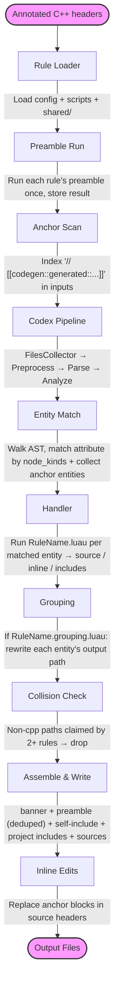

import Alert from '@pelagornis/page/components/Alert.astro';

## The pipeline

## Key design decisions

**The AST is serialised to JSON before scripts see it.** Handlers receive a JSON-encoded entity payload (the codex AST node, with heavy fields stripped, plus synthetic `_namespaces`, `_registryId`, `_outputPath`, plus a `params` key copied from the rule config). This means:

- Scripts are pure functions: JSON in, JSON out.
- Scripts can be tested with a static fixture, no compiler required.
- The full docs are also published as a single plain-text bundle at [`/llms-full.txt`](/llms-full.txt) for LLM agents and offline reference.

**Each rule gets its own LuaU execution context.** Each call (preamble, handler, grouping) executes in a fresh execution; nothing carries between invocations. Rules cannot reach each other, the filesystem, or the network unless explicitly granted via `permissions:`.

**Grouping runs before handlers.** Grouping rewrites each candidate's output path using summary metadata (`registryId`, `qualifiedName`, `namespaces`, `inputFile`, `defaultPath`) — the handler hasn't run yet, so no `source` text is available. The handler then runs with the post-grouping route exposed as `_outputPath`, so it can specialise on the file it's about to land in.

**Preamble runs once per `(rule, outputFile)` pair.** It receives the entities bound to that file (with their handler-emitted `includes`) so the preamble can specialise on what's actually needed. The result is deduplicated by content when the engine assembles each output file: if two rules contribute identical preambles to the same path, the text appears once.

**Inline injection rewrites anchor blocks in place.** Bare anchors written by hand are expanded on first run into one paired `:begin]]/:end]]` block per `inline` item (N items ⇒ N consecutive blocks). Later runs grow or shrink the run in place to match the current item count.

## What the engine does not do

- It does not instantiate templates. It sees the template declaration as the codex parser produced it.
- It does not evaluate `constexpr`. Values are represented as their source text.
- It does not perform overload resolution. The analyzer does best-effort symbol indexing but no semantic typing.
- It does not cache between runs. Every invocation re-parses every input under `--input` (incremental persistence is not implemented today).

<Alert type="info" title="Key Takeaways">
- Pipeline: load → anchor-scan → parse + analyze → collect candidates → **grouping → handler → preamble** → assemble → inline-edits.
- Handlers are pure functions over a JSON AST node. No side effects, no shared state. Receive `_outputPath` (post-grouping route).
- Grouping is path-only and runs **before** handlers; it sees summary metadata + `defaultPath`, not handler output.
- Preamble runs once per `(rule, outputFile)` pair with the bound entities; the engine dedupes by content per output file at assembly time.
</Alert>
