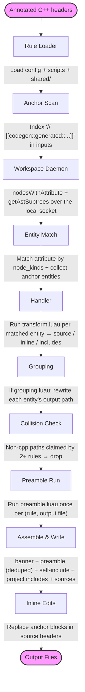

import Alert from '@pelagornis/page/components/Alert.astro';

## The pipeline

```mermaid
graph TD
    Start([Annotated C++ headers]) --> RL

    RL[Rule Loader] -- "Load config + scripts + shared/" --> AS
    AS[Anchor Scan] -- "Index '// [[codegen::generated::...]]' in inputs" --> P

    P[Workspace Daemon] -- "nodesWithAttribute + getAstSubtrees over the local socket" --> EM

    EM[Entity Match] -- "Match attribute by node_kinds + collect anchor entities" --> H

    H[Handler] -- "Run transform.luau per matched entity → source / inline / includes" --> G

    G[Grouping] -- "If grouping.luau: rewrite each entity's output path" --> CD

    CD[Collision Check] -- "Non-cpp paths claimed by 2+ rules → drop" --> PR

    PR[Preamble Run] -- "Run preamble.luau once per (rule, output file)" --> A

    A[Assemble & Write] -- "banner + preamble (deduped) + self-include + project includes + sources" --> IE

    IE[Inline Edits] -- "Replace anchor blocks in source headers" --> End([Output Files])

    style Start fill:#f9f,stroke:#333,stroke-width:2px
    style End fill:#f9f,stroke:#333,stroke-width:2px
```

## Key design decisions

**The AST is serialised to JSON before scripts see it.** Handlers receive a JSON-encoded entity payload (the codex AST node, with heavy fields stripped, plus synthetic `_namespaces`, `_registryId`, `_outputPath`, plus a `params` key copied from the rule config). This means:

- Scripts are pure functions: JSON in, JSON out.
- Scripts can be tested with a static fixture, no compiler required.
- The full docs are also published as a single plain-text bundle at [`/llms-full.txt`](/llms-full.txt) for LLM agents and offline reference.

**Each rule gets its own LuaU execution context.** Each call (preamble, handler, grouping) executes in a fresh execution; nothing carries between invocations. Rules cannot reach each other, the filesystem, or the network unless explicitly granted via `permissions:`.

**Grouping runs before handlers.** Grouping rewrites each candidate's output path using summary metadata (`registryId`, `qualifiedName`, `namespaces`, `inputFile`, `defaultPath`) — the handler hasn't run yet, so no `source` text is available. The handler then runs with the post-grouping route exposed as `_outputPath`, so it can specialise on the file it's about to land in.

**Preamble runs once per `(rule, outputFile)` pair.** It receives the entities bound to that file (with their handler-emitted `includes`) so the preamble can specialise on what's actually needed. The result is deduplicated by content when the engine assembles each output file: if two rules contribute identical preambles to the same path, the text appears once.

**Inline injection rewrites anchor blocks in place.** Bare anchors written by hand are expanded on first run into one paired `:begin]]/:end]]` block per `inline` item (N items ⇒ N consecutive blocks). Later runs grow or shrink the run in place to match the current item count.

## What the analyzer resolves

Before any rule runs, the engine builds a real semantic model over your source — not just a syntax tree. It indexes a symbol database, resolves a class hierarchy, and builds include and module dependency graphs. On top of that it computes deeper facts — per-expression types, resolved type-to-symbol bindings, references, and (on debug-info builds) byte-level memory layout — the same analysis that powers the LSP and MCP surfaces.

Rules reach all of it through two complementary surfaces: the syntactic AST node handed to each handler as JSON (see [The AST Schema](/concepts/ast-schema/)), and the [semantic query API](/concepts/semantic-query/) — a set of native functions that resolve a traversed node's **type** to its declaring symbol, pivot into that type's own declaration node, and look up symbol summaries, references, base classes, and members. Both surfaces speak JSON, so rules stay pure functions over JSON while still having the full semantic model a query away. Workspace analysis is unconditional: every run connects to the workspace daemon for the project root, and the deepest facts (types, references) come from that whole-workspace snapshot.

## What the engine does not do

- It does not instantiate templates. A rule sees the template as written; written template arguments are extracted syntactically, but no specialization is synthesised and an uninstantiated generic resolves to a `dependent` type.
- It does not fold `constexpr`. Constant values are represented as their source text; the engine does not evaluate them.
- It does not do conversion-ranking overload resolution. Overloads are indexed distinctly, but the engine will not pick the single best-viable candidate for a call site the way a compiler front-end does.
- The codegen CLI does not spawn its own daemon. It always connects to the persistent ADR-033 workspace daemon (the same one behind the LSP and MCP servers) for the `--workspace-dir` root; if nothing is already serving that root, the run fails rather than falling back to a self-contained parse.

<Alert type="info" title="Key Takeaways">
- Pipeline: load → anchor-scan → parse + analyze → collect candidates → **grouping → handler → preamble** → assemble → inline-edits.
- Handlers are pure functions over a JSON AST node. No side effects, no shared state. Receive `_outputPath` (post-grouping route).
- Grouping is path-only and runs **before** handlers; it sees summary metadata + `defaultPath`, not handler output.
- Preamble runs once per `(rule, outputFile)` pair with the bound entities; the engine dedupes by content per output file at assembly time.
</Alert>
