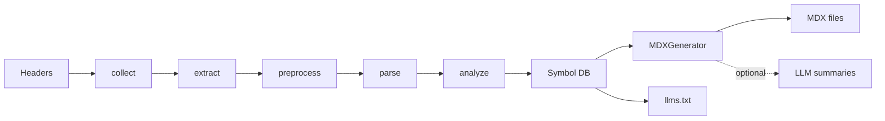

import Alert from '@pelagornis/page/components/Alert.astro';

docsgen is the terminal stage of the [codex](https://landing.codexx-dtdk.com) C++ analysis pipeline. It does not parse C++ itself — it consumes the symbol database codex produces and renders it.

## The pipeline

1. **collect** — walk the input directory for files matching the configured extensions (`.hpp`, `.h` by default), recursively.
2. **extract / preprocess / parse / analyze** — codex builds a `SourceNode` AST and resolves it into a **symbol database**: qualified names, kinds, access specifiers, member relationships, template parameters, and attached doc comments.
3. **MDXGenerator** — walks the public symbols, parses each one's doc comment, resolves cross-links, and renders MDX.
4. **FileWriter** — writes one `.mdx` file per symbol (plus catalog pages) into the output directory.
5. **llms.txt** *(optional)* — a separate generator emits a single plain-text bundle of the API.

## What docsgen adds on top of codex

The parsing is codex's job. docsgen owns everything documentation-shaped:

- **Selecting the public surface** — private/protected members, forward declarations, and excluded namespaces are filtered out. See [Public API Surface](/concepts/public-api/).
- **Parsing doc comments** — stripping comment markers, splitting `@brief`/`@param`/`@return`/etc., and extracting the first sentence as a summary. See [Doc Comments & Tags](/comments/doc-comments/).
- **Cross-linking** — turning type names in signatures and `@see` entries into links between pages. See [Cross-Linking](/comments/cross-linking/).
- **Rendering MDX** — per-kind layouts for classes, structs, enums, functions, aliases, concepts, operators, and macros, with escaped JSX-sensitive characters.
- **Catalogs** — index pages over namespaces, types, functions, and files. See [Catalog Pages](/concepts/catalogs/).
- **AI summaries / llms.txt** — optional LLM-written summaries and an agent-ready text bundle.

## Determinism

Output is a pure function of your headers:

- Symbols are **sorted by qualified name** before rendering, so file order is stable.
- Generation runs in parallel (one TBB task per symbol writing to a disjoint slot) but the result is order-independent.
- The same input produces byte-identical MDX across machines and CI runs — diffs stay meaningful.

<Alert type="info">
The one caveat is the optional `llm:` feature. AI summaries are deterministic on **warm-cache** runs (temperature 0; the cache key covers model ID + declaration text + system prompt). A cold run with a changed model or prompt will call the provider and may produce different text. The core MDX generation is always deterministic and offline. See [LLM Summaries](/ai/llm-summaries/).
</Alert>

## Where state lives

- **Output MDX** goes to `--output` (or `output:` in config).
- **The codex parse cache** lives under `.codexx/` in your workspace.
- **AI summary cache** lives under `.codexx/cache/tools/docsgen/llm_summaries.json`, keyed by the parent directory of your config file.

docsgen never modifies your input files — it only reads headers and writes to the output directory.
