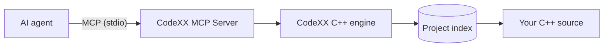

import Alert from '@pelagornis/page/components/Alert.astro';

The CodeXX MCP Server is a bridge. On one side is your AI agent; on the other is the CodeXX C++ engine, which has parsed and analysed your project. The server lets the agent ask precise questions about the code and get structured answers back.

## The problem it solves

Coding agents are good at reasoning but blind to a codebase they can't see. The usual workaround is to paste files into the context window — which is slow, lossy, and runs out of room on anything large. The model ends up guessing at relationships ("does anything call this?") that the code already answers definitively.

The CodeXX MCP Server replaces guessing with querying. The engine already knows your symbols, their relationships, and their structure. The server exposes that knowledge as MCP tools, so the agent retrieves facts instead of inferring them from text.

## How the pieces fit

- **Your agent** speaks the Model Context Protocol and calls the server's tools.
- **The server** translates those calls into queries against the engine and shapes the results for a language model — compact, paged, and ready to reason over.
- **The CodeXX engine** is the same C++ analysis engine that powers the rest of the platform. It parses your source, resolves symbols and references, and keeps the index warm.
- **Your project** is read locally by the engine. The server doesn't ship your source anywhere.

## What the tools cover

The toolset is organised around how an agent actually explores code:

- **Discovery & facts** — find symbols, get their details, see references and comments. [Read more](/tools/discovery/)
- **Reading source** — pull the exact lines for a symbol. [Read more](/tools/reading-source/)
- **Navigating code** — walk control flow, inheritance, and include structure. [Read more](/tools/navigating-code/)
- **Memory layout** — byte-level type layout from debug info. [Read more](/tools/memory-layout/)
- **Annotations** — durable labels and notes on symbols. [Read more](/tools/annotations/)
- **Discovery & health** — learn the surface and check liveness. [Read more](/tools/discovery/)

The full list is in the [Tool Catalog](/reference/tool-catalog/).

## What it is — and isn't

- It is a **read-and-annotate** interface to a C++ codebase. The agent learns about your code and can leave durable notes on it.
- It does **not** modify your source. The only state it writes is the annotations you ask it to record and an internal index/cache that speeds up later sessions.
- It is **C++-focused** — it surfaces what the CodeXX engine analyses.

<Alert type="info" title="Preview">
The CodeXX MCP Server is in preview. The capabilities documented here are grounded in the shipping tool set; deployment surface (public distribution, hosted/multi-user modes) is still being rolled out. See [Access & Auth](/trust/auth-posture/).
</Alert>
