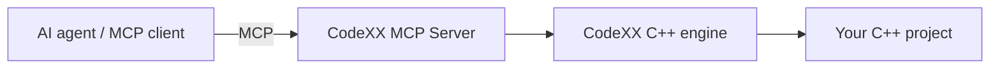

import { CardGrid } from '@astrojs/starlight/components';
import Card from '@pelagornis/page/components/Card.astro';

The **CodeXX MCP Server** connects your AI coding agent to the [CodeXX](https://landing.codexx-dtdk.com) C++ engine over the [Model Context Protocol](https://modelcontextprotocol.io). Instead of pasting files into the model and hoping it infers structure, the agent *asks*: find this symbol, who calls it, what does it reference, what does this type look like in memory, show me exactly these lines.

It speaks the same protocol your agent already knows. You point it at a C++ project, connect it to your client, and the model gains a precise, queryable view of the code.

## What it gives your agent

<CardGrid>
  <Card title="Find symbols, not strings">
    Resolve a name to the real declaration — function, class, struct,
    namespace, enum — with its kind, signature, and file:line. Or enumerate
    every symbol of a kind, or in a file, to map an unfamiliar codebase.
  </Card>
  <Card title="Follow the real relationships">
    Who calls this function? What does it reference, and from where? The server
    answers from the engine's analysis of your actual source, so the agent
    reasons about the code that exists — not a plausible guess.
  </Card>
  <Card title="Navigate code structure">
    Walk a function's control flow, a class inheritance tree, or a file's
    include graph — as a compact, paged structure the model can traverse
    without loading whole files into its context.
  </Card>
  <Card title="Read exactly the right lines">
    Pull the precise source span for a symbol, with original on-disk
    coordinates and paging for large bodies — no guessing at offsets, no
    dumping an entire file to see one function.
  </Card>
  <Card title="See type layout in memory">
    For builds with debug info, get a type's byte-by-byte layout — fields,
    base classes, the vtable pointer, and padding as a named region — so the
    agent can reason about size, alignment, and waste directly.
  </Card>
  <Card title="Leave notes that stick">
    The agent can attach short labels and longer descriptions to symbols. They
    persist across restarts and show up inline on later lookups, so knowledge
    built up in one session is there for the next.
  </Card>
  <Card title="Warm, incremental, local">
    The project is indexed once and kept warm; edits are picked up
    incrementally. Your source is read locally by the engine and is not sent
    anywhere by the server.
  </Card>
  <Card title="One call to learn the surface">
    A single `discover` call tells a cold agent the full tool set, where to
    start, and the recommended workflow — so it can use the server effectively
    without being pre-taught.
  </Card>
</CardGrid>

---

## How it fits together

Your agent talks to the server over MCP. The server is backed by the CodeXX engine, which has already parsed and analysed your project. The agent gets structured answers — symbols, references, structure, layout — instead of raw text it has to interpret.

The CodeXX MCP Server is in **preview**. See [Installation](/getting-started/installation/) to connect it to your agent, or jump to the [Quick Start](/getting-started/quick-start/).

