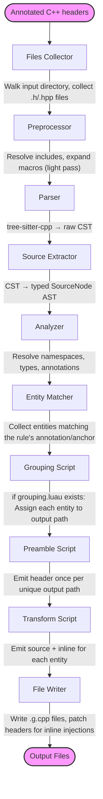

import { Steps, Aside } from '@astrojs/starlight/components';

## The pipeline

## Key design decisions

**The AST is serialized to JSON before rules see it.** Rules receive a JSON string, not a C++ object or a Clang cursor. This means:
- Rules are pure functions: JSON in, JSON out.
- Rules can be tested offline with a static fixture.
- The same AST schema is exposed via the MCP server.

**Rules run in isolated LuaU VMs.** Each rule invocation gets a fresh VM with no shared state. Rules cannot communicate with each other, cannot read the filesystem, and cannot retain state between calls.

**The preamble is deduplicated by output path.** When multiple entities route to the same output file (fan-in), the engine calls the preamble once — not once per entity.

**Inline injection is positional.** The `inline` list items are injected at the anchor comment that triggered the rule. The anchor comment is replaced in the output header.

## What the engine does not do

- It does not parse template instantiations. It sees the template declaration.
- It does not evaluate `constexpr`. Values are represented as their source text.
- It does not resolve cross-header type relationships beyond namespace context. Each entity is processed with the namespace stack available at the point of declaration.

<Aside type="tip" title="Key Takeaways">
- The pipeline is: collect → parse → extract → analyze → match → group → preamble → transform → write.
- Rules are pure functions over a JSON AST node. No side effects, no shared state.
- The preamble runs once per unique output path, regardless of entity count.
- Inline injection replaces anchor comments in the original header.
</Aside>
